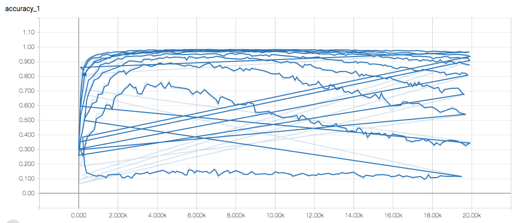
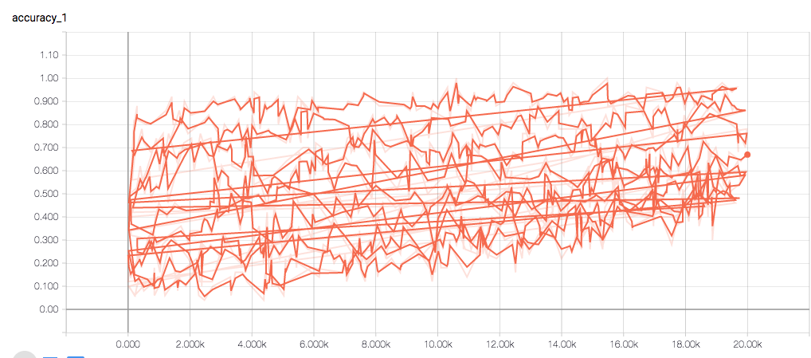

# Overview

This is a mnist data with outliers. We take mnist data, wrongly label some of the training data. And we can see how it inferences cnn result

### How to use

- You can find a simple tutorial in `test_outlier.ipynb`
- The MnistOutlier class takes the `mnist data` and `outlier_ratio` as input. The `outlier_ratio` means the percentage of the outlier data in your training data.
- To see how it changes cnn, run `CUDA_VISIBLE_DEVICES=2 python add_outlier/run_outlier.py 200000 0.5`. Assume that you want 200000 steps and outlier ratio 0.5

###  Result

- Some results: (200000 steps)

outlier ratio | test accuracy
------------- | --------------
0.1 | 0.9671
0.2 | 0.9474
0.3 | 0.9134
0.4 | 0.8928
0.5 | 0.7954
0.6 | 0.6793
0.7 | 0.5317
0.8 | 0.34069
0.9 | 0.1027

- Tensorborad

    - Test Accuracy: We can see a descent after some steps! 
    - Training Accuracy: While the training accurency seems to ascends.

    
